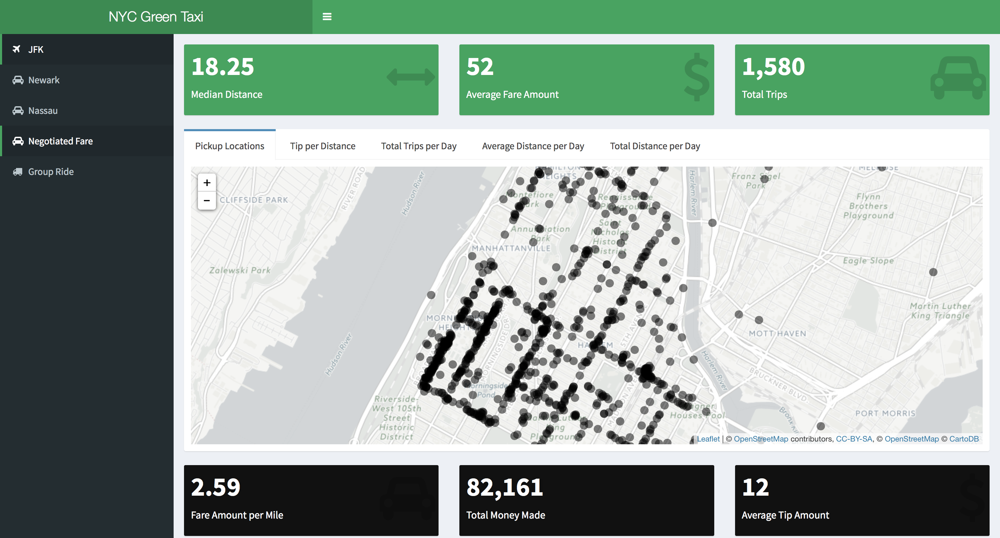
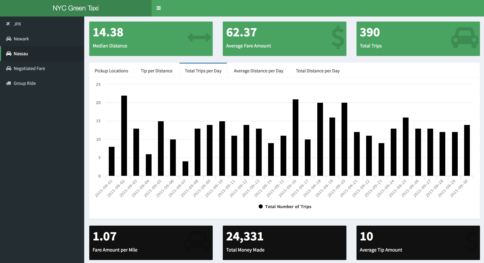
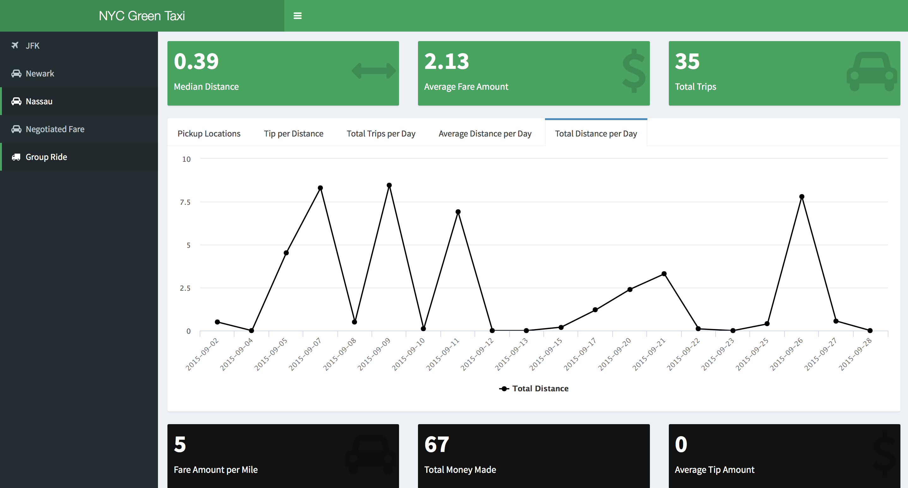

## NYC GREEN TAXI
# Data visualization in R shiny for the NYC green taxi dataset

 Shiny is a web application framework for R and it's usually run from R studio.
First, you will need to have R and R-Studio installed. In addition, you will also need the following packages which can be installed from the R studio console.
-  install.packages('shiny')
-  install.packages('leaflet')
-  install.packages('shinydashboard')  
-  install.packages('shinythemes')
-  install.packages('highcharter')
-  install.packages('data.table')

Second, open all the R files, libraries.r & server.r & ui.r & helpers.r, in R studio at the same time then go to either ui.r or server.r file and click "Run App" found at the top right corner.

Here is what each R file contains:
-  Libraries: This runs all the r packages.
-  Helpers: This contains all the csv files and all the data preprocessing
-  Server: This contains all the backend code.
-  Ui: This contains all the user interface code.

### Technical Issue
A bug might occur due to not changing the session's working directory to the source file location. This can be done by Session > Set Working Directory > To Source File Location from R-Studio.

## Here are other demo pictures of the App

 
